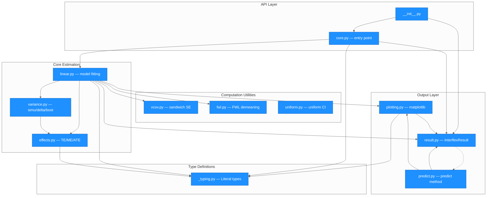
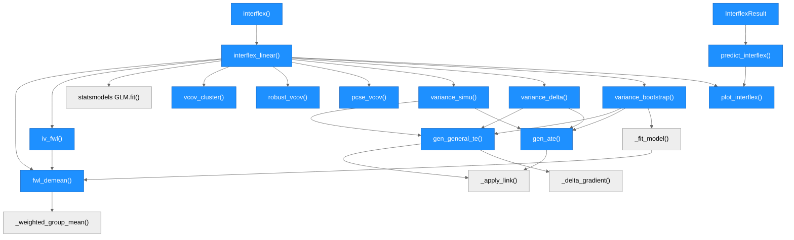
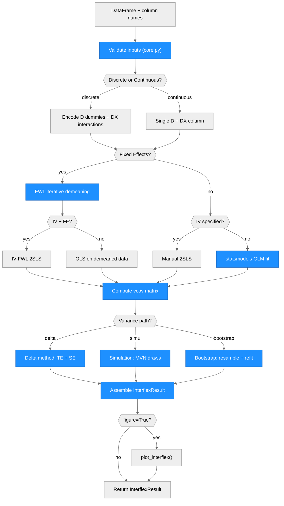

# Architecture — interflex (Python)

> Generated by scriber for run `R2PY-20260401-104010` on 2026-04-01.

## Overview

interflex is a Python package that estimates heterogeneous interaction effects between a treatment variable and a moderator variable. It is a direct translation of the `estimator = "linear"` path from the R package `xuyiqing/interflex` (v1.3.2). The package supports five GLM methods (linear, logit, probit, Poisson, negative binomial), four variance-covariance types (homoscedastic, robust HC1, clustered, PCSE), three inference paths (delta method, simulation, bootstrap), fixed effects via Frisch-Waugh-Lovell demeaning, and instrumental variables via 2SLS. Built on NumPy, SciPy, statsmodels, pandas, and matplotlib.

---

## Module Structure

### Module Reference

| Module / File | Layer | Purpose | Key Exports | Changed |
| --- | --- | --- | --- | --- |
| `interflex/__init__.py` | API | Public API surface | `interflex()`, `InterflexResult`, `__version__` | yes |
| `interflex/core.py` | API | Input validation, preprocessing, treatment type detection | `interflex()` | yes |
| `interflex/linear.py` | Core | Model fitting (GLM/FWL/IV/2SLS), vcov computation, variance dispatch | `interflex_linear()` | yes |
| `interflex/effects.py` | Core | Treatment effect / marginal effect computation, ATE/AME | `gen_general_te()`, `gen_ate()` | yes |
| `interflex/variance.py` | Core | Simulation, delta method, bootstrap variance paths | `variance_simu()`, `variance_delta()`, `variance_bootstrap()` | yes |
| `interflex/vcov.py` | Computation | Cluster-robust, HC1, and PCSE variance-covariance estimators | `vcov_cluster()`, `robust_vcov()`, `pcse_vcov()` | yes |
| `interflex/fwl.py` | Computation | Iterative FWL demeaning for fixed effects, IV-FWL 2SLS | `fwl_demean()`, `iv_fwl()` | yes |
| `interflex/uniform.py` | Computation | Bootstrap bisection and delta MVN uniform confidence intervals | `calculate_uniform_quantiles()`, `calculate_delta_uniform_ci()` | yes |
| `interflex/result.py` | Output | Result container dataclass with predict method | `InterflexResult` | yes |
| `interflex/plotting.py` | Output | Multi-panel TE/ME plots with CI ribbons, histograms | `plot_interflex()` | yes |
| `interflex/predict.py` | Output | Predict method delegation | `predict_interflex()` | yes |
| `interflex/_typing.py` | Types | Literal type aliases for method, vartype, vcov_type, treat_type | `Method`, `VarType`, `VcovType`, `TreatType`, `XdistrType` | yes |

---

## Function Call Graph

### Function Reference

| Function | Defined In | Called By | Calls | Changed | Purpose |
| --- | --- | --- | --- | --- | --- |
| `interflex()` | `core.py` | user | `interflex_linear()` | yes | Entry point: validates inputs, detects treat type, encodes factors, delegates |
| `interflex_linear()` | `linear.py` | `interflex()` | GLM fit, vcov, variance_*, plot | yes | Core estimator: builds formula, fits model, dispatches variance path |
| `gen_general_te()` | `effects.py` | variance_* | `_apply_link()`, `_delta_gradient()` | yes | Computes TE/ME at evaluation points with delta-method SE |
| `gen_ate()` | `effects.py` | variance_* | `_apply_link()` | yes | Computes ATE (discrete) or AME (continuous) |
| `_apply_link()` | `effects.py` | `gen_general_te()`, `gen_ate()` | -- | yes | Applies inverse-link (identity/expit/probit CDF/exp) |
| `_delta_gradient()` | `effects.py` | `gen_general_te()` | -- | yes | Computes gradient of TE/ME w.r.t. coefficient vector |
| `variance_simu()` | `variance.py` | `interflex_linear()` | `gen_general_te()`, `gen_ate()` | yes | MVN simulation variance with quantile CIs |
| `variance_delta()` | `variance.py` | `interflex_linear()` | `gen_general_te()`, `gen_ate()` | yes | Analytical delta-method variance with t-distribution CIs |
| `variance_bootstrap()` | `variance.py` | `interflex_linear()` | `_fit_model()`, `gen_general_te()`, `gen_ate()` | yes | Nonparametric (block) bootstrap variance |
| `_fit_model()` | `variance.py` | `variance_bootstrap()` | `fwl_demean()`, GLM | yes | Refits model on a bootstrap sample |
| `vcov_cluster()` | `vcov.py` | `interflex_linear()` | -- | yes | Cluster-robust sandwich SE with DFC correction |
| `robust_vcov()` | `vcov.py` | `interflex_linear()` | -- | yes | HC1 heteroscedasticity-consistent SE |
| `pcse_vcov()` | `vcov.py` | `interflex_linear()` | -- | yes | Panel-corrected SE (Beck & Katz 1995) |
| `fwl_demean()` | `fwl.py` | `interflex_linear()`, `_fit_model()` | `_weighted_group_mean()` | yes | Iterative FE demeaning (tol=1e-5, max 50 iter) + weighted OLS |
| `iv_fwl()` | `fwl.py` | `interflex_linear()` | `fwl_demean()` | yes | FWL + 2SLS for IV models with FE |
| `calculate_uniform_quantiles()` | `uniform.py` | variance_* | -- | yes | Bootstrap bisection for uniform CI critical value |
| `calculate_delta_uniform_ci()` | `uniform.py` | variance_* | -- | yes | MVN simulation for delta uniform CI critical value |
| `plot_interflex()` | `plotting.py` | `interflex_linear()` | -- | yes | Multi-panel TE/ME matplotlib plots with CI ribbons |
| `predict_interflex()` | `predict.py` | `InterflexResult.predict()` | `plot_interflex()` | yes | Delegates prediction plotting |

---

## Data Flow

---

## Architectural Patterns

- **R-to-Python faithful translation**: Each Python module maps directly to an R source file or C++ file, preserving function names, coefficient naming conventions, and algorithmic structure. This ensures numerical equivalence and simplifies cross-validation.
- **Lazy imports**: `linear.py` uses function-level imports for `fwl`, `vcov`, `variance`, and `plotting` modules to avoid circular dependencies and reduce startup cost.
- **Plug-in variance architecture**: The three variance paths (delta, simulation, bootstrap) share identical output structure, allowing `interflex_linear()` to switch between them with a single `vartype` parameter.
- **Dict-keyed results**: Treatment arms are keyed by string labels throughout (`est_lin`, `pred_lin`, `link_lin`, `vcov_matrix`, `avg_estimate`), supporting arbitrary numbers of discrete treatment arms without fixed data structures.
- **FWL demeaning as pre-processing**: Fixed effects are absorbed before model fitting via iterative group-mean subtraction (replicating the C++ `fastplm.cpp` convergence at tol=1e-5, max 50 iterations), keeping the OLS/2SLS step generic.
- **Sandwich SE construction**: All vcov types (homoscedastic, HC1, clustered, PCSE) are computed post-fit and passed as a matrix to the variance path, maintaining clean separation between fitting and inference.

---

## Notes

- This is a fresh implementation (v0.1.0) -- all modules are new, all marked as changed.
- The `pyproject.toml` uses `setuptools.backends._legacy:_Backend` as build-backend, which is not a valid setuptools backend string. Should be `setuptools.build_meta` for standard pip installation.
- The negative binomial parameterization (statsmodels NB2 vs R MASS::glm.nb) has not been fully cross-validated.
- The single-treatment-arm edge case raises `UnboundLocalError` instead of `ValueError` -- a minor input validation gap.
