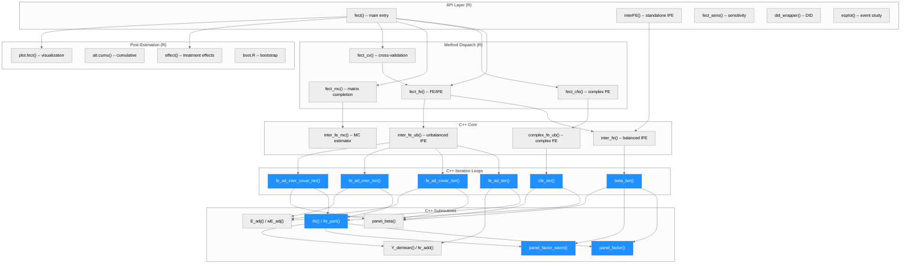
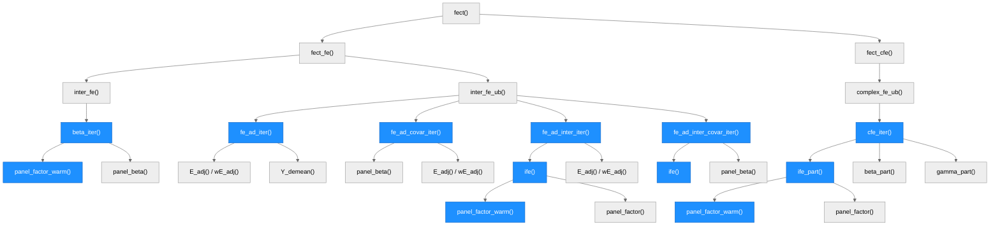
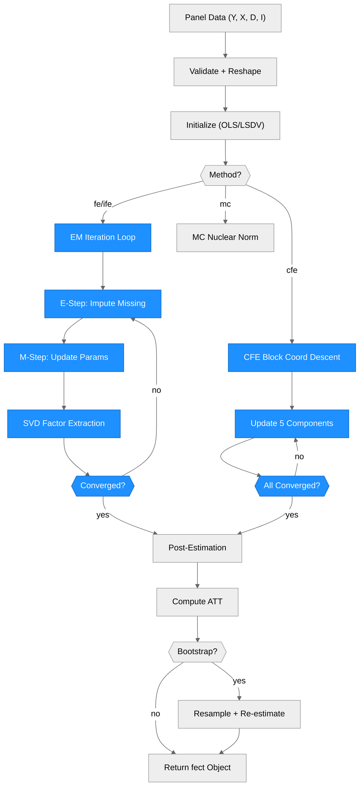

# Architecture -- fect

> Generated by scriber for run `issue-1-20260331-230107` on 2026-03-31.

## Overview

The `fect` package implements fixed effects counterfactual estimators for causal panel data analysis in R with a C++ (Armadillo) computational backend. The primary user-facing function `fect()` dispatches to method-specific estimators (FE, IFE, CFE, MC) that call into compiled C++ code for iterative estimation via EM-type algorithms. The package supports balanced and unbalanced panels, weighted estimation, covariates, interactive fixed effects (via SVD-based factor models), and bootstrap inference. Key external dependencies: Rcpp, RcppArmadillo, ggplot2, fixest, doParallel, future.

---

## Module Structure

> Blue nodes = modified in this run. All iteration loops and SVD subroutines were touched by the convergence improvements.

### Module Reference

| Module / File | Layer | Purpose | Key Exports | Changed |
| --- | --- | --- | --- | --- |
| `R/default.R` | API | Main `fect()` generic and method dispatch | `fect`, `fect.formula`, `fect.default` | no |
| `R/interFE.R` | API | Standalone interactive FE estimator | `interFE`, `interFE.formula`, `interFE.default` | no |
| `R/fe.R` | Dispatch | FE/IFE estimation wrapper; calls C++ | `fect_fe` | no |
| `R/cfe.R` | Dispatch | Complex FE estimation wrapper | `fect_cfe` | no |
| `R/mc.R` | Dispatch | Matrix completion wrapper | `fect_mc` | no |
| `R/cv.R` | Dispatch | Cross-validation for factor number | `fect_cv` | no |
| `R/support.R` | Util | Initialization helpers (`initialFit`) | `initialFit`, `align_beta0` | no |
| `R/boot.R` | Post | Bootstrap inference | (internal) | no |
| `R/effect.R` | Post | Treatment effect computation | `effect` | no |
| `R/plot.R` | Post | Visualization | `plot.fect` | no |
| `R/esplot.R` | Post | Event study plots | `esplot` | no |
| `R/cumu.R` | Post | Cumulative effects | `att.cumu` | no |
| `src/ife.cpp` | C++ Core | Balanced/unbalanced IFE dispatch | `inter_fe`, `inter_fe_ub` | no |
| `src/cfe.cpp` | C++ Core | Complex FE dispatch | `complex_fe_ub` | no |
| `src/mc.cpp` | C++ Core | Matrix completion | `inter_fe_mc` | no |
| `src/ife_sub.cpp` | C++ Iter | EM iteration loops (FE, IFE, beta) | `fe_ad_iter`, `fe_ad_covar_iter`, `fe_ad_inter_iter`, `fe_ad_inter_covar_iter`, `beta_iter` | **yes** |
| `src/cfe_sub.cpp` | C++ Iter | CFE iteration + sub-components | `cfe_iter`, `ife_part`, `beta_part`, `gamma_part`, `kappa_part` | **yes** |
| `src/fe_sub.cpp` | C++ Sub | SVD factor extraction, FE helpers | `panel_factor`, `panel_factor_warm`, `ife`, `Y_demean`, `fe_add` | **yes** |
| `src/auxiliary.cpp` | C++ Sub | E-step helpers, OLS, utility | `E_adj`, `wE_adj`, `FE_adj`, `panel_beta`, `XXinv` | no |
| `src/fect.h` | Header | All C++ declarations | (all) | **yes** |

---

## Function Call Graph

> Blue nodes = changed in this run. The convergence improvements touch every iteration loop and add warm-start SVD calls.

### Function Reference

| Function | Defined In | Called By | Calls | Changed | Purpose |
| --- | --- | --- | --- | --- | --- |
| `fect()` | `R/default.R` | user | `fect_fe`, `fect_cfe`, `fect_mc`, `fect_cv` | no | Main entry point; routes by method |
| `fect_fe()` | `R/fe.R` | `fect` | `inter_fe`, `inter_fe_ub` | no | FE/IFE estimation wrapper |
| `fect_cfe()` | `R/cfe.R` | `fect` | `complex_fe_ub` | no | Complex FE wrapper |
| `inter_fe()` | `src/ife.cpp` | `fect_fe`, `interFE` | `beta_iter`, `panel_factor`, `panel_beta` | no | Balanced panel IFE dispatch |
| `inter_fe_ub()` | `src/ife.cpp` | `fect_fe` | `fe_ad_*` iteration functions | no | Unbalanced panel IFE dispatch |
| `complex_fe_ub()` | `src/cfe.cpp` | `fect_cfe` | `cfe_iter` | no | Complex FE dispatch |
| `fe_ad_iter()` | `src/ife_sub.cpp` | `inter_fe_ub` | `E_adj`, `Y_demean`, `fe_add` | **yes** | Additive FE iteration (no factors, no covariates) |
| `fe_ad_covar_iter()` | `src/ife_sub.cpp` | `inter_fe_ub` | `panel_beta`, `E_adj`, `Y_demean` | **yes** | Additive FE + covariates iteration |
| `fe_ad_inter_iter()` | `src/ife_sub.cpp` | `inter_fe_ub` | `ife`, `E_adj`, `wE_adj` | **yes** | Additive + interactive FE iteration |
| `fe_ad_inter_covar_iter()` | `src/ife_sub.cpp` | `inter_fe_ub` | `ife`, `panel_beta`, `E_adj` | **yes** | Full model iteration (FE + IFE + covariates) |
| `beta_iter()` | `src/ife_sub.cpp` | `inter_fe` | `panel_factor_warm`, `panel_beta` | **yes** | Beta-factor alternation (balanced panel) |
| `cfe_iter()` | `src/cfe_sub.cpp` | `complex_fe_ub` | `ife_part`, `beta_part`, `gamma_part`, `kappa_part` | **yes** | 5-component block coordinate descent |
| `ife_part()` | `src/cfe_sub.cpp` | `cfe_iter` | `panel_factor_warm`, `panel_factor` | **yes** | Interactive FE component for CFE |
| `panel_factor()` | `src/fe_sub.cpp` | `ife`, `ife_part`, `beta_iter` | SVD (Armadillo) | **yes** | Cold-start SVD factor extraction |
| `panel_factor_warm()` | `src/fe_sub.cpp` | `ife`, `ife_part`, `beta_iter` | QR, eigendecomp | **yes** | Warm-start SVD via subspace iteration (new) |
| `ife()` | `src/fe_sub.cpp` | `fe_ad_inter_*` | `panel_factor_warm`, `panel_factor`, `Y_demean`, `fe_add` | **yes** | Single-step IFE extraction |
| `panel_beta()` | `src/auxiliary.cpp` | iteration loops | (leaf) | no | OLS beta from completed data |
| `E_adj()` | `src/auxiliary.cpp` | iteration loops | (leaf) | no | E-step imputation (unweighted) |
| `wE_adj()` | `src/auxiliary.cpp` | iteration loops | (leaf) | no | E-step imputation (weighted) |

---

## Data Flow

> Blue nodes = affected by this run's convergence improvements. The EM loop, E-step, M-step, SVD extraction, convergence check, and CFE block descent were all optimized.

---

## Architectural Patterns

- **EM-type iteration**: All estimators use an Expectation-Maximization framework where missing panel entries are imputed in the E-step and parameters are re-estimated in the M-step.
- **Two-language split**: R handles data validation, method dispatch, post-estimation, and plotting; C++ handles all numerical iteration via RcppArmadillo for performance.
- **Method dispatch via string**: `fect()` routes to `fect_fe`, `fect_cfe`, or `fect_mc` based on the `method` argument string.
- **Balanced/unbalanced split**: `fect_fe` routes balanced panels to `inter_fe()` (direct SVD) and unbalanced panels to `inter_fe_ub()` (EM with imputation).
- **Block coordinate descent**: CFE uses 5-component block updates (covariate fit, gamma, kappa, additive FE, interactive FE) with per-component convergence tracking.
- **Warm-start SVD** (new): `panel_factor_warm()` uses 2-step subspace iteration from the previous factor estimates, reducing per-iteration SVD cost when factors are near-converged.
- **Burn-in phase**: Weighted estimation uses a burn-in with elevated factor count to initialize the factor subspace, then restarts with the target rank. The burn-in rank is now capped at min(5r+5, d, 50).

---

## Notes

- The R-level API was not changed in this run. All modifications are internal to the C++ convergence loops.
- The `panel_factor_warm()` function is new; it provides warm-start SVD alongside the existing cold-start `panel_factor()`.
- The `ife()` and `ife_part()` signatures gained optional warm-start parameters with default empty matrices, maintaining backward compatibility.
- `beta_iter()` gained a damping parameter `omega` (default 0.8) and joint convergence monitoring (beta + factor change).
- All convergence metric denominators now include a `+ 1e-10` floor for numerical stability.
- SSR-based early convergence provides an additional exit path in `fe_ad_inter_iter` and `fe_ad_inter_covar_iter`.
