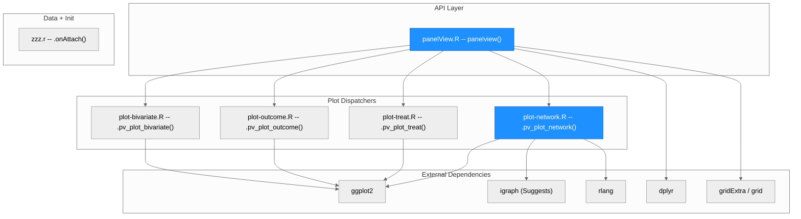
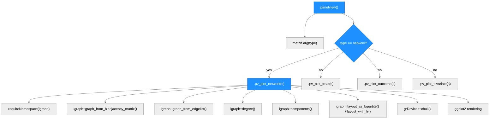
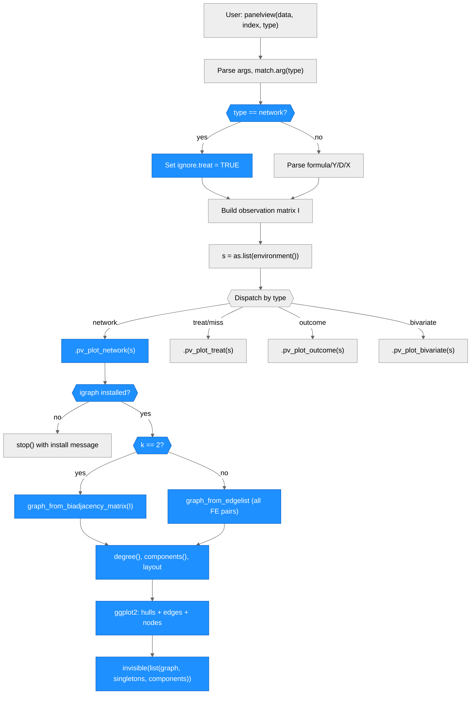

# Architecture -- panelView

> Generated by scriber for run `REQ-20260401-network-viz` on 2026-04-01.

## Overview

panelView is an R package for visualizing panel (time-series cross-sectional) data. It provides four main functionalities: (1) treatment status and missing value heatmaps, (2) outcome temporal dynamics plots, (3) bivariate treatment-outcome relationship plots, and (4) network visualization of the fixed-effects bipartite/k-partite graph structure. The package exports a single function, `panelview()`, which accepts approximately 50 parameters and dispatches internally to one of four specialized plot functions. All rendering uses ggplot2. The network visualization uses igraph (conditional, in Suggests) for graph computation and layout. panelView was published in the Journal of Statistical Software (doi:10.18637/jss.v107.i07). Authors: Hongyu Mou, Licheng Liu, and Yiqing Xu. Current version: 1.2.1.

---

## Module Structure

> Blue nodes = modified or created in this run. panelView.R was modified (new type routing, `fe` parameter, network dispatch). plot-network.R is entirely new.

### Module Reference

| Module / File | Layer | Purpose | Key Exports | Changed |
| --- | --- | --- | --- | --- |
| `R/panelView.R` | API | Single entry point; argument parsing, data validation, observation matrix I construction, type-based dispatch | `panelview()` | yes |
| `R/plot-treat.R` | Core | Treatment status heatmap and missing-value visualization | `.pv_plot_treat()` (internal) | no |
| `R/plot-outcome.R` | Core | Outcome variable temporal dynamics plots | `.pv_plot_outcome()` (internal) | no |
| `R/plot-bivariate.R` | Core | Bivariate treatment-outcome scatter/line plots | `.pv_plot_bivariate()` (internal) | no |
| `R/plot-network.R` | Core | Bipartite/k-partite graph of fixed effects; singleton detection; connected component visualization | `.pv_plot_network()` (internal) | yes (new) |
| `R/zzz.r` | Data | Package load message | `.onAttach()` | no |
| `DESCRIPTION` | Meta | Package metadata, dependencies | -- | yes |
| `NAMESPACE` | Meta | Import/export declarations | -- | yes |
| `man/panelview.Rd` | Docs | Man page for panelview() | -- | yes |

---

## Function Call Graph

> The network branch is checked first in the dispatch block, before outcome/treat/bivariate, because it short-circuits treatment-related processing.

### Function Reference

| Function | Defined In | Called By | Calls | Changed | Purpose |
| --- | --- | --- | --- | --- | --- |
| `panelview()` | `R/panelView.R` | user (exported) | `.pv_plot_treat`, `.pv_plot_outcome`, `.pv_plot_bivariate`, `.pv_plot_network` | yes | Single entry point: parse args, build observation matrix I, dispatch to plot type |
| `.pv_plot_network()` | `R/plot-network.R` | `panelview()` | igraph::graph_from_biadjacency_matrix, igraph::degree, igraph::components, igraph::layout_as_bipartite, ggplot2 | yes (new) | Build bipartite/k-partite graph, detect singletons, draw network plot |
| `.pv_plot_treat()` | `R/plot-treat.R` | `panelview()` | ggplot2 | no | Treatment status heatmap |
| `.pv_plot_outcome()` | `R/plot-outcome.R` | `panelview()` | ggplot2 | no | Outcome dynamics plot |
| `.pv_plot_bivariate()` | `R/plot-bivariate.R` | `panelview()` | ggplot2 | no | Bivariate scatter/line plot |

---

## Data Flow

> Blue nodes = new or modified paths in this run. The network type bypasses formula/treatment parsing entirely via `ignore.treat = TRUE`, then short-circuits to `.pv_plot_network()`.

---

## Architectural Patterns

- **Environment-list dispatch**: `panelview()` captures its full local environment as a list (`s <- as.list(environment())`) and passes it to each `.pv_plot_*()` dispatcher. This avoids long parameter lists but means each dispatcher has access to all ~50 variables.
- **Conditional dependency (igraph)**: igraph is in Suggests, not Imports. All igraph calls use `igraph::` namespace qualification. Availability is checked at runtime with `requireNamespace()`. This keeps the package lightweight for users who do not need network visualization.
- **rlang .data pronoun**: The `.data` pronoun from rlang is used in ggplot2 `aes()` calls to satisfy R CMD check. rlang is in Imports; `.data` is imported via NAMESPACE.
- **Type-based routing**: The `type` parameter controls which plot function is called. Network is checked first in the dispatch block to enable early exit before treatment-related processing.
- **Bipartite vs k-partite branching**: When `fe = NULL` (default), the standard bipartite graph is built from the observation matrix I using igraph's native bipartite functions. When `fe` provides additional FE columns, a general k-partite graph is built from an edge list of all FE-pair combinations per observation.

---

## Notes

- The observation matrix `I` (TT x N, binary) is the biadjacency matrix of the bipartite graph. It is computed by `panelview()` before dispatch and is available to `.pv_plot_network()` via the environment list `s`.
- Singletons (degree-1 nodes) correspond to fixed-effect categories that absorb all variation from a single observation, as described in Correia (2016) Section 3.4.
- Connected components determine which groups of units and time periods are identifiable together in fixed-effects estimation (Correia 2016, Section 3.5).
- The time gap validation block in `panelView.R` is guarded with `if (type != "network")` because network plots do not require evenly-spaced time periods and the computation crashes on single-period panels.
- Non-unique vertex names exist in the bipartite case (a unit and time period with the same label share `V(g)$name`). The `fe_type` attribute distinguishes them. The k-partite case avoids this with prefixed names (`dimension:category`).
