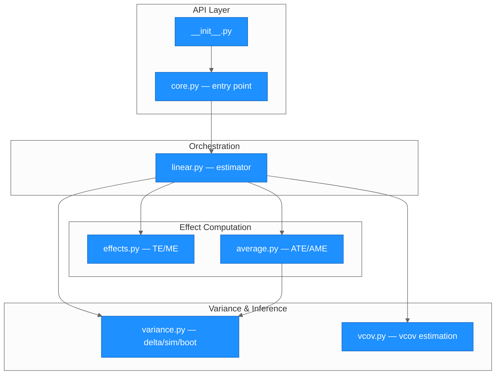
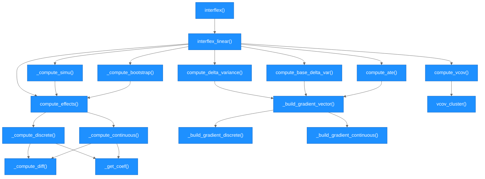
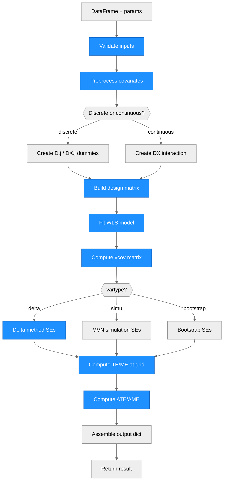

# Architecture — interflex (Python)

> Generated by scriber for run `20260331-interflex-py-224717` on 2026-03-31.

## Overview

The `interflex` Python package estimates heterogeneous treatment effects and marginal effects as a function of a continuous moderator variable, using linear interaction models. It is a translation of the linear estimator path from R's `interflex` package (xuyiqing/interflex). The package is written in Python 3.9+, uses a `src/` layout with setuptools, and depends on numpy, pandas, statsmodels, and scipy. The architecture follows a layered pipeline: user input flows through a validation/preprocessing entry point, into a model-fitting orchestrator, and then fans out to specialized modules for effect computation, variance estimation, and average effect calculation.

---

## Module Structure

### Module Reference

| Module / File | Layer | Purpose | Key Exports | Changed |
| --- | --- | --- | --- | --- |
| `src/interflex/__init__.py` | API | Re-exports public API | `interflex` | yes |
| `src/interflex/core.py` | API | Input validation, preprocessing, treatment detection, covariate encoding, diff values | `interflex()` | yes |
| `src/interflex/linear.py` | Orchestration | Design matrix construction, WLS fitting, dispatches to delta/simu/bootstrap paths, assembles output | `interflex_linear()` | yes |
| `src/interflex/effects.py` | Computation | Treatment effect (discrete) and marginal effect (continuous) at eval grid, difference computation | `compute_effects()`, `_get_coef()` | yes |
| `src/interflex/variance.py` | Inference | Delta-method SEs via gradient vectors, vcov submatrix extraction, diff SEs, vcov matrix | `compute_delta_variance()`, `compute_base_delta_variance()`, `_build_gradient_vector()` | yes |
| `src/interflex/vcov.py` | Inference | Homoscedastic, HC1 robust, CGM cluster-robust sandwich estimator | `compute_vcov()`, `vcov_cluster()` | yes |
| `src/interflex/average.py` | Computation | Weighted ATE (discrete) and AME (continuous) with delta-method SEs | `compute_ate()` | yes |

---

## Function Call Graph

### Function Reference

| Function | Defined In | Called By | Calls | Changed | Purpose |
| --- | --- | --- | --- | --- | --- |
| `interflex()` | `core.py` | user | `interflex_linear` | yes | Public entry: validate inputs, preprocess covariates, detect treatment type, build eval grid |
| `interflex_linear()` | `linear.py` | `interflex` | `compute_vcov`, `compute_effects`, `compute_delta_variance`, `compute_ate`, `_compute_simu`, `_compute_bootstrap` | yes | Build design matrix, fit WLS, dispatch to variance path, assemble output dict |
| `_compute_delta()` | `linear.py` | `interflex_linear` | `compute_effects`, `compute_delta_variance`, `compute_base_delta_variance`, `compute_ate` | yes | Delta-method inference path |
| `_compute_simu()` | `linear.py` | `interflex_linear` | `compute_effects` | yes | Simulation-based inference via MVN draws from N(beta, Sigma) |
| `_compute_bootstrap()` | `linear.py` | `interflex_linear` | `compute_effects` | yes | Nonparametric bootstrap (block bootstrap for clustered data) |
| `compute_effects()` | `effects.py` | `_compute_delta`, `_compute_simu`, `_compute_bootstrap` | `_compute_discrete`, `_compute_continuous` | yes | Route to discrete TE or continuous ME computation |
| `_compute_discrete()` | `effects.py` | `compute_effects` | `_get_coef`, `_compute_diff` | yes | TE(x) = beta_D + beta_DX * x for each eval point |
| `_compute_continuous()` | `effects.py` | `compute_effects` | `_get_coef`, `_compute_diff` | yes | ME(x) = beta_D + beta_DX * x for each eval point |
| `_compute_diff()` | `effects.py` | `_compute_discrete`, `_compute_continuous` | `_get_coef` | yes | Difference estimates at moderator quantiles |
| `_get_coef()` | `effects.py` | multiple | -- | yes | Safe coefficient lookup (returns 0.0 for missing keys) |
| `compute_delta_variance()` | `variance.py` | `_compute_delta` | `_build_gradient_vector` | yes | Delta-method SEs for TE/ME, predicted values, diffs, and vcov matrix |
| `compute_base_delta_variance()` | `variance.py` | `_compute_delta` | `_build_gradient_vector` | yes | Delta-method SEs for base group predicted values |
| `_build_gradient_vector()` | `variance.py` | `compute_delta_variance`, `compute_base_delta_variance`, `compute_ate` | `_build_gradient_discrete`, `_build_gradient_continuous` | yes | Construct analytical gradient and coefficient index mapping |
| `compute_vcov()` | `vcov.py` | `interflex_linear` | `vcov_cluster` | yes | Dispatch to homoscedastic, HC1, or cluster-robust vcov |
| `vcov_cluster()` | `vcov.py` | `compute_vcov` | -- | yes | CGM sandwich estimator with small-sample correction |
| `compute_ate()` | `average.py` | `_compute_delta`, `_compute_simu`, `_compute_bootstrap` | `_build_gradient_vector`, `_get_coef` | yes | Weighted ATE/AME with optional delta-method SE |

---

## Data Flow

---

## Architectural Patterns

- **Layered pipeline**: Input validation (core.py) is fully separated from model fitting (linear.py), which is separated from effect computation (effects.py) and variance estimation (variance.py). Each layer has a single responsibility.
- **Strategy pattern for variance**: The three variance methods (delta, simulation, bootstrap) are implemented as separate private functions in linear.py (`_compute_delta`, `_compute_simu`, `_compute_bootstrap`), dispatched by the `vartype` parameter. All three produce the same output structure.
- **Coefficient name tracking**: Coefficients are tracked as `{name: value}` dicts throughout. This avoids fragile positional indexing and makes vcov submatrix extraction reliable via name-based lookup.
- **Internal group renaming**: Discrete treatment labels are mapped to `Group.1`, `Group.2`, etc. internally to avoid special characters in column/coefficient names. Original labels are restored in the output dict keys.
- **Sum-coded dummies for factors**: Categorical covariates are converted to sum-coded dummy variables (matching R's `contr.sum`), ensuring the intercept represents the grand mean.
- **Sandwich estimator**: Cluster-robust variance uses the Cameron-Gelbach-Miller (CGM) small-sample degrees-of-freedom correction: `dfc = (M/(M-1)) * ((N-1)/(N-K))`.
- **Gradient reuse**: The `_build_gradient_vector()` function is shared between delta-method TE/ME SEs, predicted value SEs, and ATE/AME SEs, ensuring consistent gradient construction.

---

## Notes

- This is a new package (initial creation). All modules and functions are new.
- Fixed effects, instrumental variables, PCSE, non-linear estimators, plotting, and uniform CIs from the R package are intentionally excluded per scope.
- Factor covariate handling in `Z_ref` is simplified: user-provided `Z_ref` for factor variables defaults factor dummies to 0 rather than fully resolving the specified level to sum-coded values.
- Bootstrap is sequential (no parallelism). Block bootstrap is used for clustered data.
- The build backend was changed from the spec's `setuptools.backends._legacy:_Backend` to the standard `setuptools.build_meta`.
