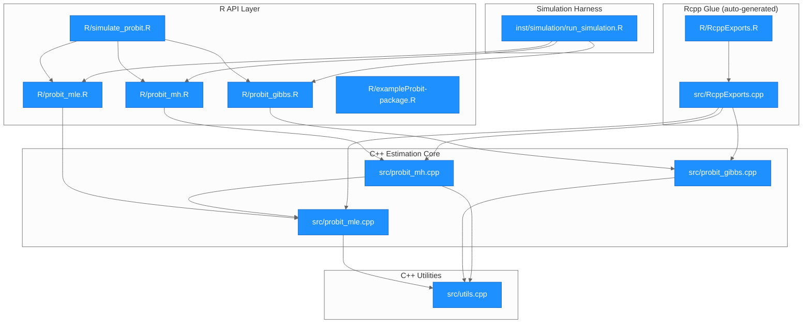
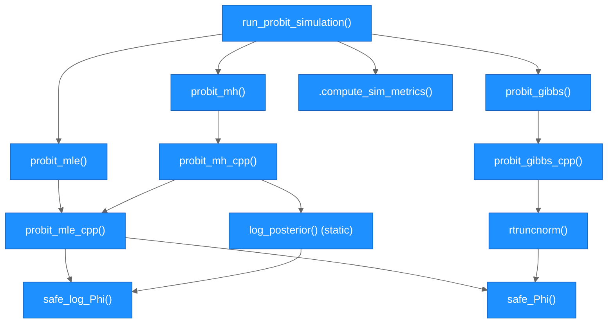
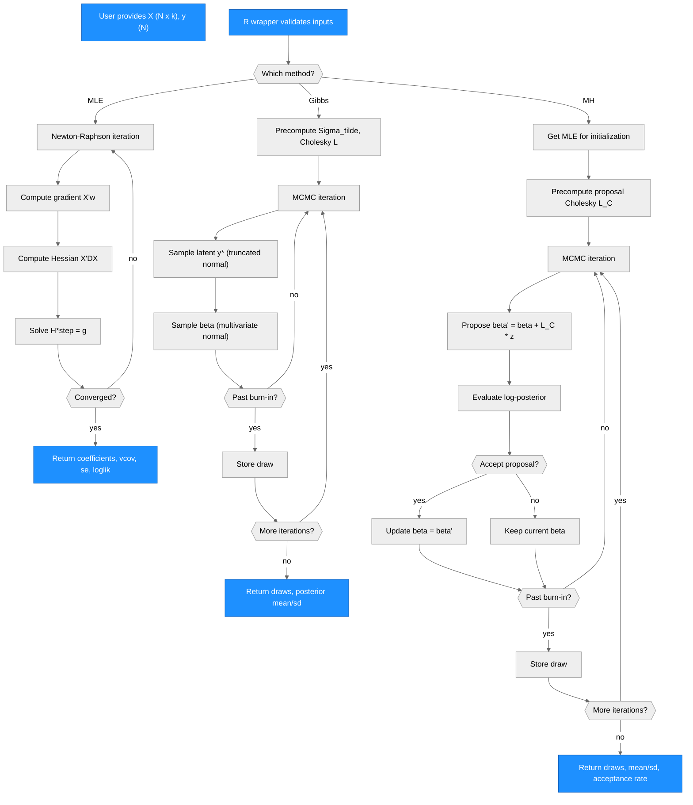

# Architecture -- exampleProbit

> Generated by scriber for run `probit-20260401-103705` on 2026-04-01.

## Overview

exampleProbit is an R package that implements three probit model estimation methods -- MLE via Newton-Raphson, Bayesian Gibbs sampling (Albert-Chib data augmentation), and random-walk Metropolis-Hastings -- with all core computations written in C++ via Rcpp and RcppArmadillo. The package also includes a Monte Carlo simulation framework for comparing estimator performance across sample sizes. The design separates R-level input validation and user interface from C++-level numerical computation, with shared utilities factored into a common module to ensure numerical stability across all estimators.

---

## Module Structure

> All modules are new (created in this run). The R API layer provides input validation and roxygen2-documented wrappers. The C++ core performs all numerical computation. The MH estimator depends on MLE for warm-start initialization.

### Module Reference

| Module / File | Layer | Purpose | Key Exports | Changed |
| --- | --- | --- | --- | --- |
| `R/probit_mle.R` | API | R wrapper with input validation for MLE | `probit_mle()` | yes |
| `R/probit_gibbs.R` | API | R wrapper with input validation for Gibbs | `probit_gibbs()` | yes |
| `R/probit_mh.R` | API | R wrapper with input validation for MH | `probit_mh()` | yes |
| `R/simulate_probit.R` | API | Monte Carlo simulation function | `run_probit_simulation()` | yes |
| `R/exampleProbit-package.R` | API | Package-level docs, useDynLib | (package doc) | yes |
| `R/RcppExports.R` | Glue | Auto-generated Rcpp bindings (R side) | (internal) | yes |
| `src/probit_mle.cpp` | Core | MLE via Newton-Raphson | `probit_mle_cpp()` | yes |
| `src/probit_gibbs.cpp` | Core | Albert-Chib Gibbs sampler | `probit_gibbs_cpp()` | yes |
| `src/probit_mh.cpp` | Core | Random-walk Metropolis-Hastings | `probit_mh_cpp()` | yes |
| `src/utils.cpp` | Utils | Shared numerical utilities | `safe_log_Phi()`, `safe_Phi()`, `rtruncnorm()` | yes |
| `src/RcppExports.cpp` | Glue | Auto-generated Rcpp bindings (C++ side) | (internal) | yes |
| `inst/simulation/run_simulation.R` | Sim | Standalone Monte Carlo script | (script) | yes |
| `tests/testthat/test-probit_mle.R` | Test | MLE unit tests (10 tests) | — | yes |
| `tests/testthat/test-probit_gibbs.R` | Test | Gibbs unit tests (9 tests) | — | yes |
| `tests/testthat/test-probit_mh.R` | Test | MH unit tests (9 tests) | — | yes |

---

## Function Call Graph

### Function Reference

| Function | Defined In | Called By | Calls | Changed | Purpose |
| --- | --- | --- | --- | --- | --- |
| `probit_mle()` | `R/probit_mle.R` | user, `run_probit_simulation` | `probit_mle_cpp` | yes | R wrapper: validates inputs, calls C++ MLE |
| `probit_gibbs()` | `R/probit_gibbs.R` | user, `run_probit_simulation` | `probit_gibbs_cpp` | yes | R wrapper: validates inputs, calls C++ Gibbs |
| `probit_mh()` | `R/probit_mh.R` | user, `run_probit_simulation` | `probit_mh_cpp` | yes | R wrapper: validates inputs, calls C++ MH |
| `run_probit_simulation()` | `R/simulate_probit.R` | user | `probit_mle`, `probit_gibbs`, `probit_mh`, `.compute_sim_metrics` | yes | Monte Carlo simulation across sample sizes |
| `.compute_sim_metrics()` | `R/simulate_probit.R` | `run_probit_simulation` | (base R) | yes | Computes bias, RMSE, coverage, time for one scenario |
| `probit_mle_cpp()` | `src/probit_mle.cpp` | `probit_mle`, `probit_mh_cpp` | `safe_log_Phi`, `safe_Phi`, `arma::solve`, `arma::inv_sympd` | yes | Newton-Raphson MLE with gradient and Hessian |
| `probit_gibbs_cpp()` | `src/probit_gibbs.cpp` | `probit_gibbs` | `rtruncnorm`, `arma::chol`, `arma::inv_sympd` | yes | Albert-Chib Gibbs with data augmentation |
| `probit_mh_cpp()` | `src/probit_mh.cpp` | `probit_mh` | `probit_mle_cpp`, `log_posterior`, `arma::chol` | yes | Random-walk MH with adaptive proposal |
| `log_posterior()` | `src/probit_mh.cpp` | `probit_mh_cpp` | `safe_log_Phi` | yes | Log-posterior for MH accept/reject |
| `safe_log_Phi()` | `src/utils.cpp` | `probit_mle_cpp`, `log_posterior` | `R::pnorm` | yes | Numerically stable log(Phi(x)) |
| `safe_Phi()` | `src/utils.cpp` | `probit_mle_cpp`, `rtruncnorm` | `R::pnorm` | yes | Standard normal CDF wrapper |
| `rtruncnorm()` | `src/utils.cpp` | `probit_gibbs_cpp` | `R::pnorm`, `R::qnorm`, `R::runif` | yes | Truncated normal sampling via inverse CDF |

---

## Data Flow

---

## Architectural Patterns

- **R/C++ separation**: R wrappers handle input validation (type coercion, dimension checks, constraint enforcement) while C++ handles all numerical computation. This keeps the R layer thin and the C++ layer focused on performance.

- **Shared utility module**: `utils.cpp` provides `safe_log_Phi`, `safe_Phi`, and `rtruncnorm` used across multiple estimators, ensuring consistent numerical stability (log-space CDF computation, probability clamping) without code duplication.

- **Cholesky-based sampling**: Both Gibbs (`arma::chol(Sigma_tilde)`) and MH (`arma::chol(proposal_cov)`) use Cholesky decomposition for efficient multivariate normal sampling via L*z where z is a standard normal draw. Gibbs precomputes its Cholesky once since Sigma_tilde depends only on X and the prior.

- **MH warm-start from MLE**: `probit_mh_cpp` calls `probit_mle_cpp` internally to obtain the MLE as the starting point for the Markov chain, reducing burn-in time and improving convergence.

- **Log-scale acceptance**: MH acceptance is computed entirely on the log scale (`log(u) < log_post_prop - log_post_current`), avoiding numerical overflow from exponentiating large log-posterior differences.

- **Rcpp export naming convention**: C++ functions use `_cpp` suffix (`probit_mle_cpp`, etc.) to avoid name collision with R wrapper functions that share the user-facing names.

- **Error-tolerant simulation harness**: Each estimator call in the simulation is wrapped in `tryCatch()`, recording failures as NA and computing metrics only over valid replications. This prevents a single replication failure from crashing the entire simulation.

---

## Notes

- This is a greenfield package (all files created in this run).
- The MH default scale was tuned from 1.0 to 2.4 during development to bring acceptance rates into the target 20-50 percent range. The scale of 2.4 yields approximately 40 percent acceptance across all sample sizes tested.
- R CMD check produces one ERROR and one WARNING from missing `pdflatex` on the build system; these are environment issues, not package defects. All package-level checks pass.
- The simulation harness runs sequentially (no parallelization) for CRAN compliance.
